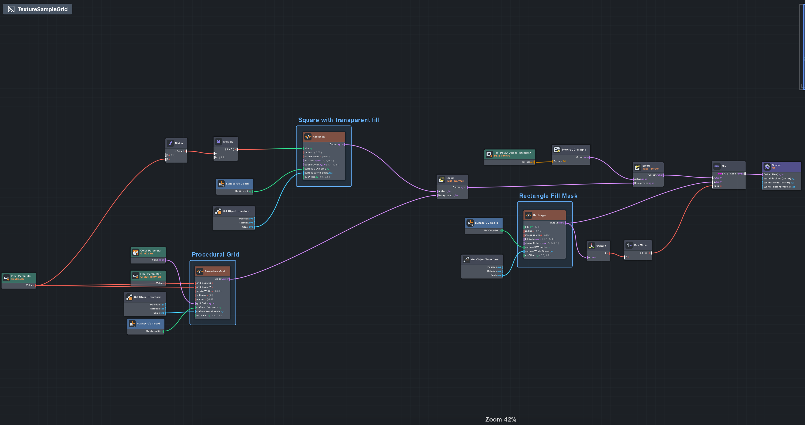
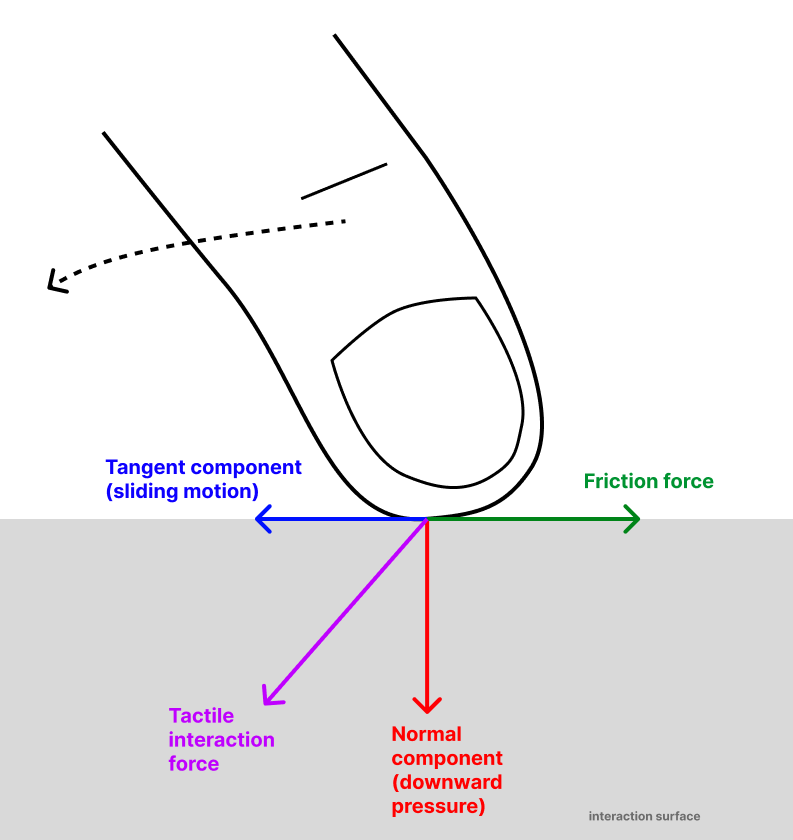
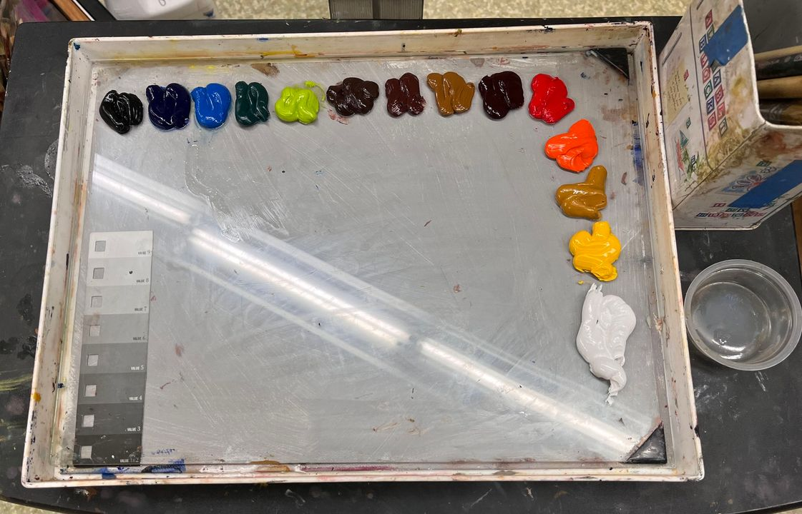
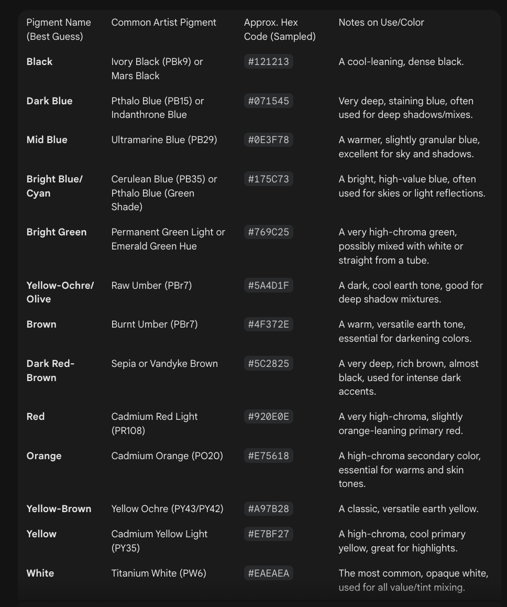

  

<h1 align="center">Eyedropper</h1>

## Overview

An eyedropper color picker for Snap Spectacles AR glasses.

  <a href="https://a-sumo.github.io/posts/eyedropper-for-spectacles-ar-glasses/">
    <strong>Eyedropper for Spectacles AR Glasses</strong>
  </a>

## Implementation

### Color Sampling

The color data is read from the user's camera feed. The feed is cropped to a smaller region using the Spectacles Samples cropping functionality, then individual pixels are sampled for color extraction.

### Magnified Grid View

Inspired by [Figma's eyedropper UI](https://help.figma.com/hc/en-us/articles/27643269375767-Sample-colors-with-the-eyedropper-tool), the interface includes:
- A magnified view of the sampled area covered with a grid representing pixel samples
- A real-time indicator of the selected pixel's color
- Updates as the user hovers over the crop area's surface

### UI and Materials

The Spectacles UI Kit handles key UI elements. Custom materials for rectangle corners and grids use Custom Code Nodes in the Material Graph Editor.

  

<em>Procedural Grid Material Graph</em>

## Components

### Scripts

| Script | Description |
|--------|-------------|
| `CropAreaSelector.ts` | Handles reading and displaying colors using ProceduralTextureProvider and getPixels() |

### Core Methods

The CropAreaSelector class provides methods for:
- Converting local coordinates to pixel coordinates
- Clamping crop regions within texture bounds
- Sampling pixel data from the camera feed
- Updating textures and materials with sampled colors

## Security Considerations

The getPixels API is [restricted](https://developers.snap.com/lens-studio/features/remote-apis/remote-service-module) when using the Remote Service Module, which may prompt a user authorization screen.

The rationale: if you can read pixels locally, you could extract sensitive information and exfiltrate it through API calls. By restricting local pixel access when remote services are enabled, Snap ensures that image analysis either:
- Stays entirely on-device (no remote module), or
- The user is explicitly warned that data is leaving the device (remote module triggers authorization prompt)

## Comfort and Ease of Use

Mid-air interactions lack the friction that stabilizes hand trajectories during tactile interaction:

  

This friction enables finer-grained movement without information loss. Filtering alone cannot reproduce this effect.

### Alternative: Multimodal AI

As an alternative to physical interaction, a Gemini model can segment palette color blobs and extract pigments directly from an image:

  
  &nbsp;&nbsp;&nbsp;
  

<em>Left: Input image | Right: Extracted pigments via Gemini</em>

Both interaction modes are available:
- **Deterministic**: Complete user control over color selection
- **Probabilistic**: AI-assisted extraction with yielded control

## Usage

1. Open the project in Lens Studio
2. Use the crop area to select a region of the camera feed
3. Hover over the magnified grid to select individual pixels
4. The selected color updates in real-time

## Related

- [Article: Eyedropper for Spectacles AR Glasses](https://a-sumo.github.io/posts/eyedropper-for-spectacles-ar-glasses/)
- [Color Spaces Project](../Color-Spaces/)
- [Vector Fields Project](../Vector-Fields/)
