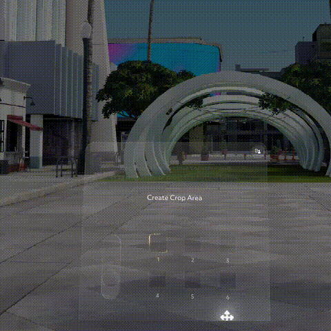

# Spectacles Lens Studio Samples

A collection of self-contained sample projects for [Lens Studio](https://developers.snap.com/lens-studio/home) targeting Spectacles AR Glasses. Each project demonstrates specific features and techniques with minimal dependencies.

## Projects

| | | |
|:--:|:--|:--:|
|  | **Eyedropper**<br>A color picker tool that samples colors from the real world.<br>[`Eyedropper/`](Eyedropper/) |  |

---

## Getting Started

1. Download and install [Lens Studio](https://developers.snap.com/lens-studio/home)
2. Clone this repository
3. Open any project's `.esproj` file in Lens Studio

## Adding New Projects

Each sample project follows this structure:

```
ProjectName/
├── ProjectName.esproj
└── Assets/
    ├── Scripts/
    ├── Materials/
    ├── Images/
    └── Prefabs/
```

## License

See [LICENSE](LICENSE) for details.
