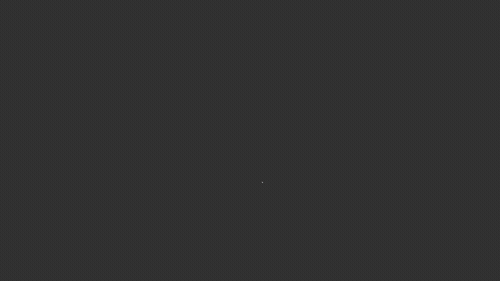
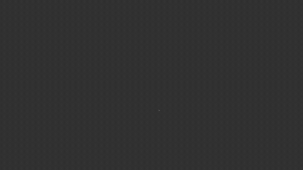
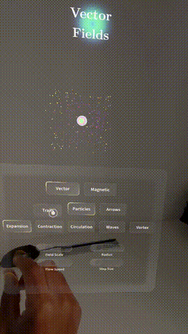
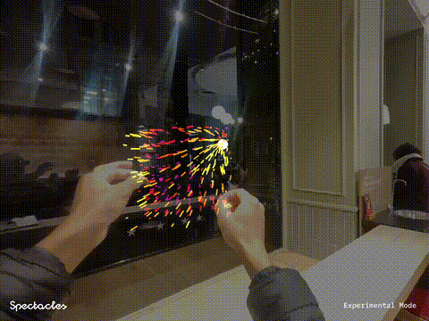
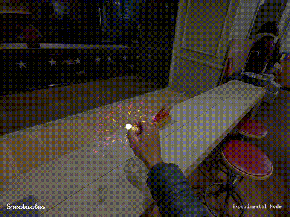
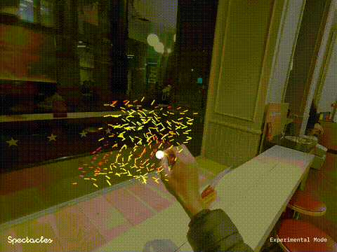
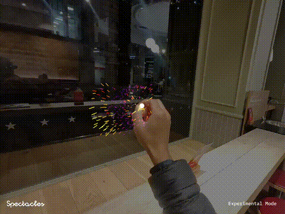
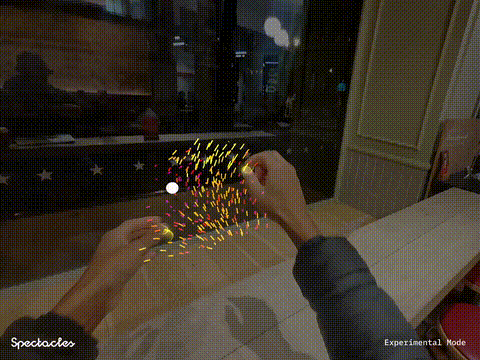

<p align="center">
  
</p>

<h1 align="center">Vector Fields 2.0</h1>

## Overview

This project visualizes vector fields in augmented reality using procedurally generated tube meshes that deform along field lines. Version 2.0 adds AI-generated vector fields: describe a field in natural language and the system generates it at runtime on Spectacles.

For the base implementation (analytical presets only), see [Vector-Fields-1.0](../Vector-Fields-1.0/).

This repository accompanies a blog post that I encourage you to check out!

<p align="center">
  <a href="https://a-sumo.github.io/posts/visualizing-vector-fields-on-ar-glasses/">
    <strong>Visualizing Vector Fields on AR Glasses</strong>
  </a>
</p>

## Implementation

### Tube Mesh Generation

Tubes are generated procedurally using the MeshBuilder API. Rings of vertices are created along the tube length and connected with triangles, with hemispherical end caps.

<p align="center">
  
</p>

### GPU Tube Deformation

Deforming tubes while preserving volume requires computing a moving T/N/B (Tangent, Normal, Binormal) coordinate frame at each point. A naive offset where rings stay horizontal produces incorrect endcaps:

<p align="center">
  
  &nbsp;&nbsp;&nbsp;
  
</p>
<p align="center"><em>Left: Naive offset (rings stay horizontal) | Right: TNB frame (rings perpendicular to tangent)</em></p>

<p align="center">
  
</p>

### Field Integration

Starting from sample points, the shader integrates along the field: `pos += field(pos) * stepSize`, computing local coordinate frames that follow the path curvature.

<p align="center">
  
</p>

### Visualization Modes

The implementation supports three visualization modes that can be toggled at runtime:

- **Arrows**: Static vectors showing direction and magnitude at discrete sample points. Best for understanding local field behavior.
- **Flow Lines**: Tubes that follow field lines by integrating through the field. Shows how the field flows through space.
- **Particles**: Animated points that advect along the field, revealing the dynamic nature of the flow.

<p align="center">
  
</p>
<p align="center"><em>Demo showing the three visualization modes: arrows, flow lines, and particles</em></p>


## Components

### Scripts

| Script | Description |
|--------|-------------|
| `VectorField.ts` | Main vector field visualization with multiple preset field types (Expansion, Contraction, Circulation, Vortex, Waves) |
| `MagneticField.ts` | Magnetic dipole field visualization with two interactive magnets |
| `TubeTest.ts` | Test component for tube mesh generation and GPU deformation |
| `FieldController.ts` | Controller for switching between field types and managing field parameters |
| `DynamicSettingsPanel.ts` | Runtime UI panel for adjusting field parameters |
| `MagnetPhysics.ts` | Physics simulation for magnet interactions |
| `IridescentMaterial.ts` | Iridescent material controller for magnet visuals |
| `AiFieldGenerator.ts` | **[2.0]** AI field generation pipeline: prompt to Claude, evaluate field recipe on 3D grid, write to texture atlas |

### Shaders

| Shader | Description |
|--------|-------------|
| `VectorField.js` | GPU shader that integrates field lines and computes T/N/B frames for tube deformation |
| `MagneticField.js` | Computes magnetic field from two dipole magnets using the formula `B = (3(m·r̂)r̂ - m) / r³` |
| `AiVectorField.js` | **[2.0]** GPU shader that samples vector field from a 2D texture atlas encoding a 3D volume |
| `TubeTest.js` | Test shader for basic tube deformation along parametric curves |
| `MagnetPole.js` | Shader for rendering magnet pole indicators |
| `IridescentShader.js` | Iridescent surface shader for magnet visualization |


## Field Types

### Vector Field Presets

#### Contraction
Vectors spiral inward toward a target point, creating sink-like behavior.

<p align="center">
  
</p>
<p align="center"><em>Manim visualization of contraction field</em></p>

<p align="center">
  
</p>
<p align="center"><em>Demo on Spectacles</em></p>

#### Expansion
Radial waves emanate outward from the target with 3D oscillation perpendicular to the flow.

<p align="center">
  
</p>
<p align="center"><em>Manim visualization of expansion field</em></p>

<p align="center">
  
</p>
<p align="center"><em>Demo on Spectacles</em></p>

#### Circulation
A 3D swirling vortex that mixes rotation in multiple planes around the target.

<p align="center">
  
</p>
<p align="center"><em>Manim visualization of circulation field</em></p>

<p align="center">
  
</p>
<p align="center"><em>Demo on Spectacles</em></p>

#### Vortex
Rotating cellular patterns with an added spin component based on angular position.

<p align="center">
  
</p>
<p align="center"><em>Manim visualization of vortex field</em></p>

<p align="center">
  
</p>
<p align="center"><em>Demo on Spectacles</em></p>

#### Waves
Sinusoidal interference patterns where each axis oscillates based on the other two coordinates.

<p align="center">
  
</p>
<p align="center"><em>Manim visualization of waves field</em></p>

<p align="center">
  
</p>
<p align="center"><em>Demo on Spectacles</em></p>

### Magnetic Field

Physically-based magnetic field from two dipole magnets. Each dipole creates a field following:

```
B = (3(m·r̂)r̂ - m) / r³
```

<p align="center">
  
</p>
<p align="center"><em>Manim visualization of magnetic dipole field</em></p>

<p align="center">
  
</p>
<p align="center"><em>Demo on Spectacles with interactive magnet positioning</em></p>

The magnets can be repositioned interactively to observe field line changes in real-time.

### AI-Generated Fields (2.0)

Describe a vector field in natural language and the system generates it at runtime. The pipeline works by calling Claude to produce a field recipe (a JSON composition of primitives like vortex, curl noise, spiral, dipole), evaluating that recipe on a 32x32x32 grid in TypeScript, and packing the results into a 2D texture atlas that the shader samples with trilinear interpolation.

Built-in presets for testing without an API key: `tornado`, `galaxy`, `ocean_currents`, `black_hole`, `dueling_vortices`.

See [AI_FIELD_GUIDE.md](AI_FIELD_GUIDE.md) for full implementation details.

#### API Key Setup

The AI generation feature requires an Anthropic API key.

1. Create a `.env` file in the project root (this file is gitignored):
   ```
   ANTHROPIC_API_KEY=sk-ant-your-key-here
   ```

2. In Lens Studio, add an `InternetModule` component to your scene.

3. On the `AiFieldGenerator` component, set:
   - `internetModule`: reference to the InternetModule
   - `_apiKey`: your API key from `.env`
   - `_apiUrl`: `https://api.anthropic.com/v1/messages` (default)

Alternatively, if using Snap's [Remote Service Gateway](https://developers.snap.com/spectacles/about-spectacles-features/apis/remoteservice-gateway), configure the gateway token and endpoint instead. Adjust the request format in `AiFieldGenerator.callAI()` if the gateway wraps the Anthropic API differently.

**Important:** Never commit your API key. The `.env` file is listed in `.gitignore` at the repository root.

## Performance & LOD

In order to improve performance on Spectacles and avoid freezes due to unintentionally high parameters, a vertex budget has been defined (32K vertices per-mesh limit) and all procedural geometry generation settings are ajusted all parameters to fit within this budget.

Additional Level of Detail (LOD) presets are available via the settings panel. 
Among others, they control:
- radial segments: Cross-section smoothness (4 = square-ish, 8 = round)
- length segments: Curve fidelity and integration steps
- grid size: Spatial density of field samples

## Usage

1. Open the project in Lens Studio
2. Select a field type from the FieldController
3. Adjust parameters using DynamicSettingsPanel
4. For magnetic fields, reposition the magnet objects to see field changes

## Exports

Pre-built lens packages are available in the `exports/` folder. These contain material and shader for either field mode, that you can drag and drop in any project.
- `VectorField.lspkg` - Vector field presets lens
- `MagneticField.lspkg` - Magnetic field lens

## Related

- [Article: Vector Fields in Augmented Reality](https://a-sumo.github.io/posts/visualizing-vector-fields-on-ar-glasses/)
- [Color Spaces Project](../Color-Spaces/)
- [Eyedropper Project](../Eyedropper/)
