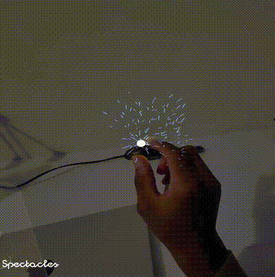
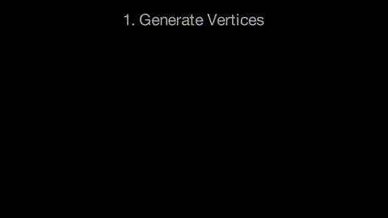
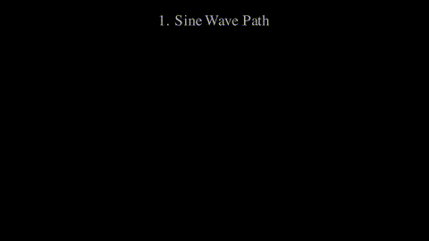
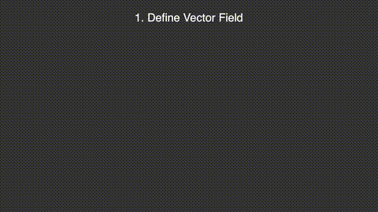
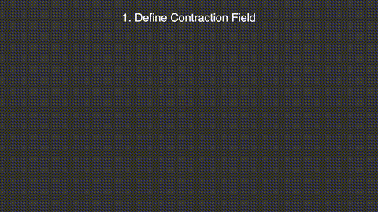
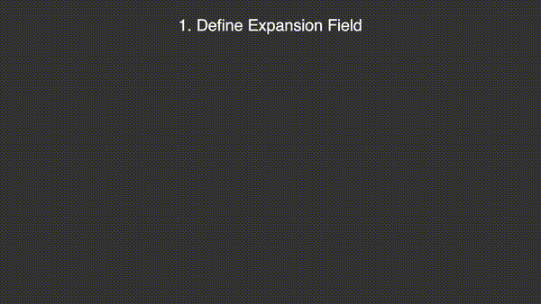
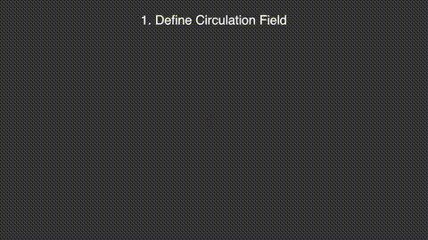
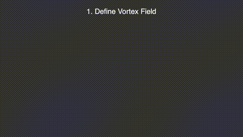
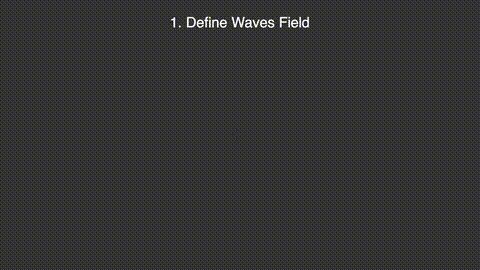
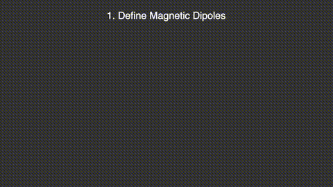

<p align="center">
  
  
</p>

<h1 align="center">Vector Fields</h1>

<p align="center">
  <strong>3D Vector Field Visualization for Spectacles AR</strong><br>
  A Lens Studio project for 2024 Spectacles Augmented Reality Glasses
</p>

## Overview

This project visualizes vector fields in augmented reality using procedurally generated tube meshes that deform along field lines. The implementation supports multiple field types including mathematical presets and physically-based magnetic dipole fields.

## Components

### Scripts

| Script | Description |
|--------|-------------|
| `VectorField.ts` | Main vector field visualization with multiple preset field types (Expansion, Contraction, Circulation, Vortex, Waves) |
| `MagneticField.ts` | Magnetic dipole field visualization with two interactive magnets |
| `TubeTest.ts` | Test component for tube mesh generation and GPU deformation |
| `FieldController.ts` | Controller for switching between field types and managing field parameters |
| `DynamicSettingsPanel.ts` | Runtime UI panel for adjusting field parameters |
| `MagnetPhysics.ts` | Physics simulation for magnet interactions |
| `IridescentMaterial.ts` | Iridescent material controller for magnet visuals |

### Shaders

| Shader | Description |
|--------|-------------|
| `VectorField.js` | GPU shader that integrates field lines and computes T/N/B frames for tube deformation |
| `MagneticField.js` | Computes magnetic field from two dipole magnets using the formula `B = (3(m·r̂)r̂ - m) / r³` |
| `TubeTest.js` | Test shader for basic tube deformation along parametric curves |
| `MagnetPole.js` | Shader for rendering magnet pole indicators |
| `IridescentShader.js` | Iridescent surface shader for magnet visualization |

## Implementation

### Tube Mesh Generation

Tubes are generated procedurally using the MeshBuilder API. Rings of vertices are created along the tube length and connected with triangles, with hemispherical end caps.

<p align="center">
  
</p>

### GPU Tube Deformation

The shader deforms tubes along parametric curves by computing a T/N/B (Tangent, Normal, Binormal) coordinate frame at each point.

<p align="center">
  
</p>

### Field Integration

Starting from sample points, the shader integrates along the field: `pos += field(pos) * stepSize`, computing local coordinate frames that follow the path curvature.

<p align="center">
  
</p>

## Field Types

### Vector Field Presets

#### Contraction
Vectors spiral inward toward a target point, creating sink-like behavior.

<p align="center">
  
</p>

#### Expansion
Radial waves emanate outward from the target with 3D oscillation perpendicular to the flow.

<p align="center">
  
</p>

#### Circulation
A 3D swirling vortex that mixes rotation in multiple planes around the target.

<p align="center">
  
</p>

#### Vortex
Rotating cellular patterns with an added spin component based on angular position.

<p align="center">
  
</p>

#### Waves
Sinusoidal interference patterns where each axis oscillates based on the other two coordinates.

<p align="center">
  
</p>

### Magnetic Field

Physically-based magnetic field from two dipole magnets. Each dipole creates a field following:

```
B = (3(m·r̂)r̂ - m) / r³
```

<p align="center">
  
</p>

The magnets can be repositioned interactively to observe field line changes in real-time.

## Usage

1. Open the project in Lens Studio
2. Select a field type from the FieldController
3. Adjust parameters using DynamicSettingsPanel
4. For magnetic fields, reposition the magnet objects to see field changes

## Exports

Pre-built lens packages are available in the `exports/` folder. These contain material and shader for either field mode, that you can drag and drop in any project.
- `VectorField.lspkg` - Vector field presets lens
- `MagneticField.lspkg` - Magnetic field lens

## Related

- [Article: Vector Fields in Augmented Reality](https://a-sumo.github.io/posts/visualizing-vector-fields-on-ar-glasses/)
- [Color Spaces Project](../Color-Spaces/)
- [Eyedropper Project](../Eyedropper/)
